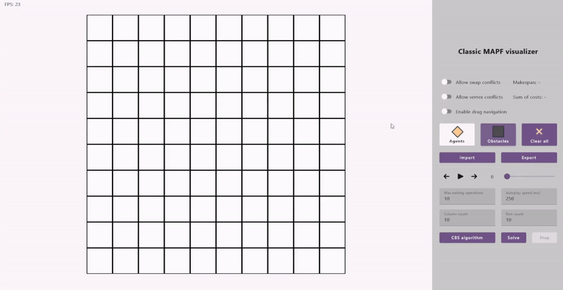
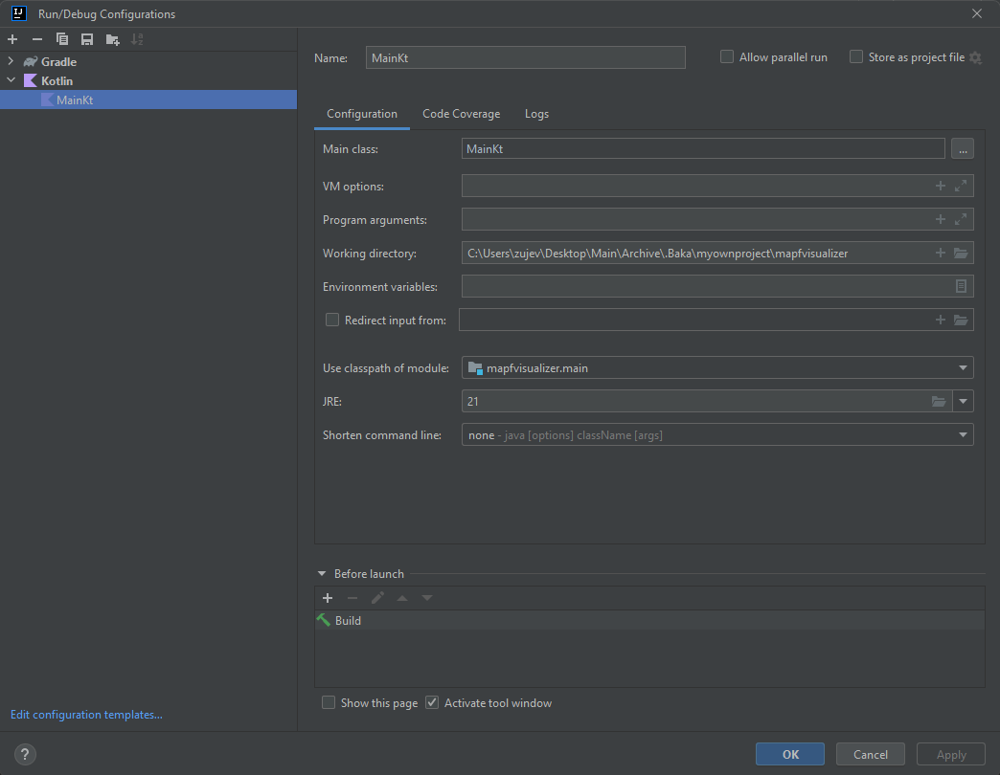
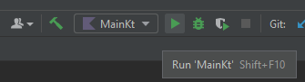

# Classical MAPF Visualizer

## Overview
The Classical MAPF Visualizer is an open-source tool designed to visualize
and simulate the classical Multi-Agent Pathfinding (MAPF) problem. This project
was developed by Valērijs Zujevičs as part of his bachelor's thesis at the
University of Latvia, under the supervision of Mg.sc.comp. Santa Bartušēvica.
The tool aims to provide a modern, intuitive interface for researchers and
developers to better understand, analyze, and develop MAPF algorithms.\
\


## Features
- **Modern and Intuitive Interface**: A user-friendly GUI that allows easy
interaction with the visualization tool.
- **Extensive Settings and Functions**: Offers a variety of settings to
customize the visualization and simulation process.
- **Visualization of Algorithms**: Supports visualization for MAPF algorithms, 
specifically only CBS (Conflict-Based Search) at this time.
- **Importing and exporting**: Allows you to export and import both the problem
and agent locations, as well as the solution itself.
- **Simulation and Modeling**: Allows you to create, simulate and analyze
  MAPF scenarios.
- **Modular Architecture**: Facilitates easy modification and addition of
  new features.

## Pre requirement

1. Latest version of [**Intellij Idea Community edition**](https://www.jetbrains.com/idea/download/#section=windows)
2. Preinstalled [**Java 21**](https://www.oracle.com/java/technologies/downloads/#java21)
3. Preinstalled [**Gradle 8.7.0**](https://gradle.org/install/)

## Installation
- ### To install and run the Classical MAPF Visualizer using Windows console, follow these steps:

1. **Clone the Repository**:
   ```bash
   git clone https://github.com/Mr4el/mapf-visualizer.git
   cd mapf-visualizer
   ```

2. **Install Dependencies**:  
   Ensure you have Gradle 8.7.0+ installed using
   ```bash
   gradle -v
   ```
   If not, you can download it from [here](https://gradle.org/install/).

3. **Build the Project**:  
  Use Gradle to build the project:
   ```bash
   gradlew build
   ```

4. **Run the Application**:
   ```bash
   gradlew run
   ```

- ### To install and run the Classical MAPF Visualizer using IntelliJ IDEA, follow these steps:
1. **Clone repository**:  
   * Click `File → New → Project from Version Control...`
   * Enter the repository link `https://github.com/Mr4el/mapf-visualizer.git` and click the "Clone" button

2. **Customizing configurations**:  
   * Click `Run → Edit Configurations...`
   * Select JRE 21
   * Select Main class `src/main/kotlin/Main.kt`
   * If the configuration was not created by default, create it with
     `Run → Edit Configurations... → Add New Configuration → Kotlin` and configure the following settings:\
   \
   
   **Note:** Make sure Gradle has downloaded all dependencies and the project is indexed by the IDE.

3. **Run project**:\
   \
   

## Usage
**Note:** The files with demo MAPF problems are located in the `./examples` folder

### Creating a Scenario
- **Define Agents and Goals**: Specify the start and goal positions for each agent.
- **Set Obstacles**: Place obstacles in the grid to create more complex scenarios.
- *Remove Agents and Obstacles**: When the appropriate mode is selected, tap again on the agent's start or 
end point or on an obstacle to remove it

### Running a Simulation
- **Choose Algorithm**: Select the desired algorithm for pathfinding from the provided options.
- **Simulate**: Run the simulation to see the agents move from their start positions to their goal positions while avoiding collisions.

### Visualization Controls
- **Play/Pause**: Start or pause the simulation.
- **Step Through**: Move step-by-step through the simulation to analyze specific moments.
- **Adjust Speed**: Change the speed of the simulation for better visualization.

### Configuration of settings
- **Enter value**: Enter the desired numeric value
- **Apply changes**: Press Enter or take the focus off the input field

## Import/Export file format
- The `.map` and `.scen` files are formatted to match the benchmarks presented [here](https://movingai.com/benchmarks/mapf/index.html).  
- Exporting and importing the solution has its own custom format with a `.solution` extension:
    ```
    version 1
    makespan <int>
    sumOfCosts <int>
    <index → int>   <relative map path → string>    <start x → int> <start y → int> <end x → int>   <end y → int>   <path → (int,int) ... (int,int)>
    ```

    Example:

    ```
    version 1
    makespan 5
    sumOfCosts 13
    0	my_custom_map.map	1	0	2	3	(1,0) (2,0) (2,1) (2,1) (2,2) (2,3)
    ```

## Contribution
Contributions to the Classical MAPF Visualizer are welcome. To contribute, follow these steps:

1. **Fork the Repository**: Create a fork of the repository on GitHub.
2. **Create a Branch**: Create a new branch for your feature or bugfix.
3. **Make Changes**: Implement your changes and commit them to your branch.
4. **Submit a Pull Request**: Open a pull request to merge your changes into the main repository.

## License
This project is licensed under the MIT License. See the [LICENSE](LICENSE) file for more details.

## Acknowledgments
This project was developed as part of a bachelor's thesis at the University of Latvia.
Special thanks to the supervisor Mg.sc.comp. Santa Bartušēvica for her guidance and support.
